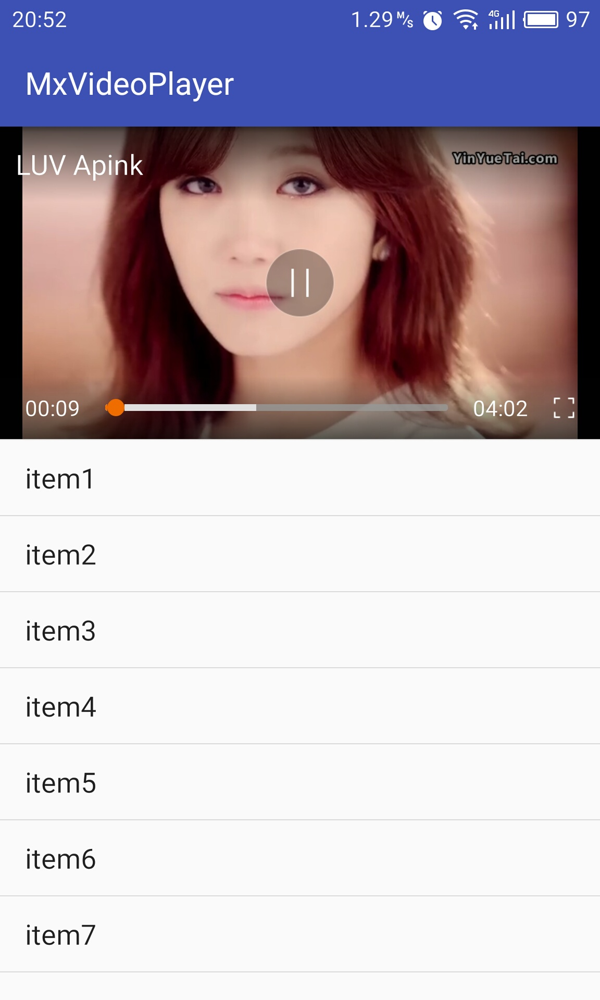

# MxVideoPlayer
A simple video player support mobile and TV. Video playback base on [ijkplayer](https://github.com/Bilibili/ijkplayer). The player supports more video formats by default.

##ScreenShot
<p>

&nbsp;&nbsp;&nbsp;

<br/>
<br/>

&nbsp;&nbsp;&nbsp;

<br/>
<br/>

</p>

##Usage
First you can add gradle dependency with command :
```
defaultConfig {
   ......
   minSdkVersion 16  // at least 16
   ......
   }
dependencies {
    ......
    compile 'com.henryblue.mxvideoplayer:xvideoplayer:1.0.9'
   }

```
To add gradle dependency you need to open build.gradle (in your app folder,not in a project folder) then copy and add the dependencies there in the dependencies block.
(if you can not play video or other, you can try to use version 1.0.8, but it will make you
project bigger.)
##Use in mobile
1. Add to layout
```
    <hb.xvideoplayer.MxVideoPlayerWidget
        android:id="@+id/mpw_video_player"
        android:layout_width="match_parent"
        android:layout_height="210dp" />
```
2. set play url and start video
```
    @Override
    protected void onCreate(Bundle savedInstanceState) {
        .......
        MxVideoPlayerWidget videoPlayerWidget = (MxVideoPlayerWidget) findViewById(R.id.mpw_video_player);
        videoPlayerWidget.startPlay("play url", MxVideoPlayer.SCREEN_LAYOUT_NORMAL, "video name");
        .......
    }
         
    @Override
    protected void onPause() {
        super.onPause();
        MxVideoPlayer.releaseAllVideos();
    }

    @Override
    public void onBackPressed() {
        if (MxVideoPlayer.backPress()) {
            return;
        }
        super.onBackPressed();
    }
```
if you want auto fullscreen, you can do that:
```
    MxVideoPlayerWidget.startFullscreen(this, MxVideoPlayerWidget.class, "video url", "video name");
```

##Usage in TV
1. Add to layout
```
    <hb.xvideoplayer.MxTvPlayerWidget
        android:id="@+id/mpw_video_player"
        android:layout_width="match_parent"
        android:layout_height="match_parent" />
```
2. set play url and start video
```
    @Override
    protected void onCreate(Bundle savedInstanceState) {
        ........
        mVideoPlayerWidget = (MxTvPlayerWidget) findViewById(R.id.mpw_video_player);
        mVideoPlayerWidget.startPlay("video url", "video name");
        ........
    }


    @Override
    public boolean onKeyDown(int keyCode, KeyEvent event) {
        return mVideoPlayerWidget.requestKeyDown(keyCode, event);
    }

    @Override
    public boolean onKeyUp(int keyCode, KeyEvent event) {
        return mVideoPlayerWidget.requestKeyUp(keyCode, event);
    }

    @Override
    protected void onPause() {
        super.onPause();
        MxVideoPlayer.releaseAllVideos();
    }
```
MxTvPlayerWidget handle Key event including KEYCODE_VOLUME_DOWN, KEYCODE_VOLUME_UP, KEYCODE_DPAD_RIGHT, KEYCODE_DPAD_LEFT,
KEYCODE_BACK and KEYCODE_ENTER.
